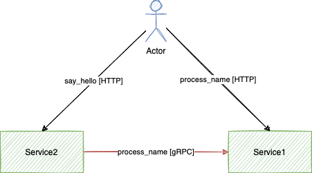

# AioHTTP with gRPC example

In this example I have two services. Service2 provides a method `proccess_name` with access to it through REST endpoint ang gRPC. The `process_name` just make the name upper case.
Service1 provides a method `say_hello` with access by REST and asks service1 to process name by gRPC.

The schema looks like this:



## Run example

```bash
docker-compose build
docker-compose up
```

## Direct call

```bash
http http://localhost:8080/api/v1/name\?name\=test X-Request-Id:12345

service1_1 | {"levelname": "INFO", "name": "app.services", "lineno": 9, "message": "action=process_name, status=success, name=TEST", "request_id": "12345"}
service1_1 | {"levelname": "INFO", "name": "aiohttp.access", "lineno": 206, "message": "request: 172.24.0.1 GET /api/v1/name?name=test HTTP/1.1 200 194 0.000669 200 194", "request_id": "12345", "remote_address": "172.24.0.1", "first_request_line": "GET /api/v1/name?name=test HTTP/1.1", "response_status": 200, "response_size": 194, "request_time_frac": "0.000669"}
```

## Call through service2

```bash
http http://localhost:8081/api/v1/say-hello\?name\=test X-Request-Id:12345

service1_1 | {"levelname": "INFO", "name": "app.services", "lineno": 9, "message": "action=process_name, status=success, name=TEST", "request_id": "12345"}
service2_1 | {"levelname": "INFO", "name": "app.services", "lineno": 13, "message": "action=say_hello, status=success, hello=Hello, TEST!", "request_id": "12345"}
service2_1 | {"levelname": "INFO", "name": "aiohttp.access", "lineno": 206, "message": "request: 172.24.0.1 GET /api/v1/say-hello?name=test HTTP/1.1 200 192 0.002573 200 192", "request_id": "12345", "remote_address": "172.24.0.1", "first_request_line": "GET /api/v1/say-hello?name=test HTTP/1.1", "response_status": 200, "response_size": 192, "request_time_frac": "0.002573"}
```
